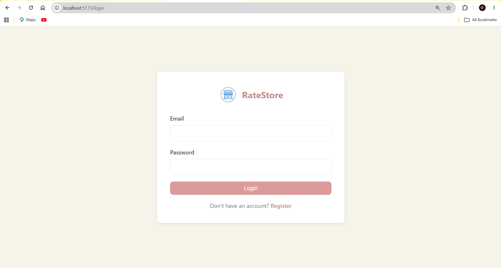
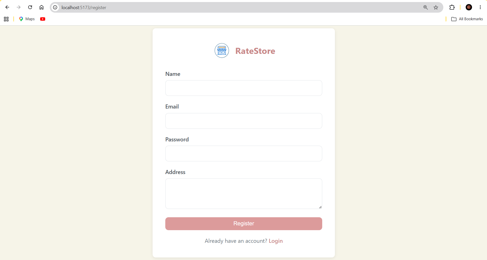
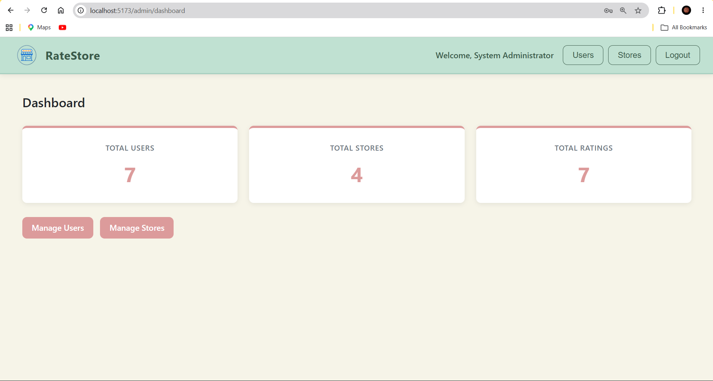
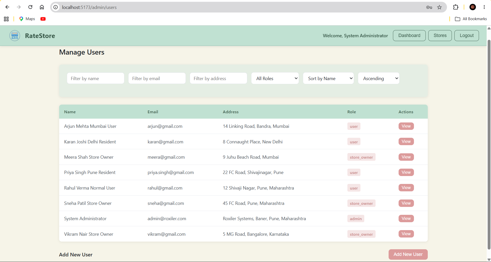
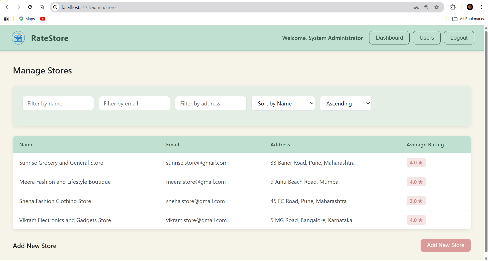
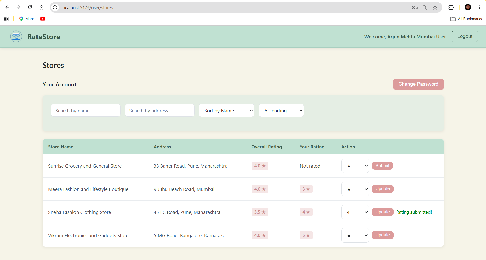
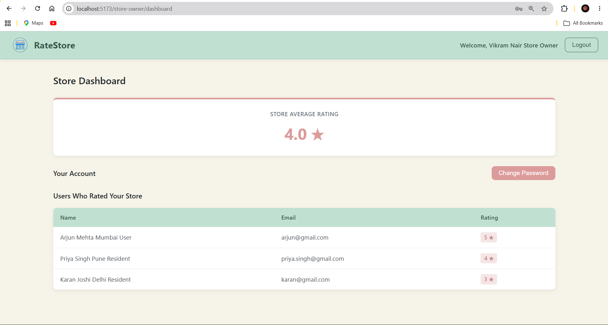

# Roxiler Coding Challenge

A full-stack web application that allows users to submit ratings for stores registered on the platform. Built as part of the Roxiler Systems internship coding challenge.

---

## Tech Stack

**Backend**
- Node.js with Express.js
- MySQL with mysql2 driver
- JWT for authentication
- bcryptjs for password hashing

**Frontend**
- React.js with Vite
- React Router for navigation
- Axios for API communication

---

## User Roles

| Role | Access |
|------|--------|
| System Administrator | Manage users and stores, view dashboard stats |
| Normal User | Browse stores, submit and modify ratings |
| Store Owner | View store ratings and rater details |

---

## Features

**System Administrator**
- Dashboard showing total users, stores, and ratings
- Add and manage users with any role
- Add stores and assign store owners
- Filter and sort all listings by name, email, address, and role

**Normal User**
- Register and log in to the platform
- Browse all registered stores with overall and personal ratings
- Submit and modify store ratings (1 to 5)
- Update account password

**Store Owner**
- View average rating of their store
- See list of users who submitted ratings
- Update account password

---

## Form Validations

| Field | Rule |
|-------|------|
| Name | Minimum 20, maximum 60 characters |
| Email | Standard email format |
| Password | 8 to 16 characters, at least one uppercase letter and one special character |
| Address | Maximum 400 characters |
| Rating | Between 1 and 5 |

---

## Screenshots

### Login


### Register


### Admin Dashboard


### Admin Users


### Admin Stores


### User Stores


### Store Owner Dashboard


---

## Getting Started

### Prerequisites
- Node.js v18 or above
- MySQL 8 or above

### Database Setup

Create the database and run the schema:

```bash
mysql -u root -p < database/schema.sql
```

Or manually run the SQL file in MySQL Workbench.

### Backend Setup

```bash
cd backend
npm install
```

Create a `.env` file inside the `backend` folder:
```
PORT=5000
DB_HOST=localhost
DB_USER=root
DB_PASSWORD=your_mysql_password
DB_NAME=roxiler_challenge
JWT_SECRET=your_jwt_secret_key
```

## Default Admin Credentials

```
Email:    admin@roxiler.com
Password: Admin@1234
```

---

